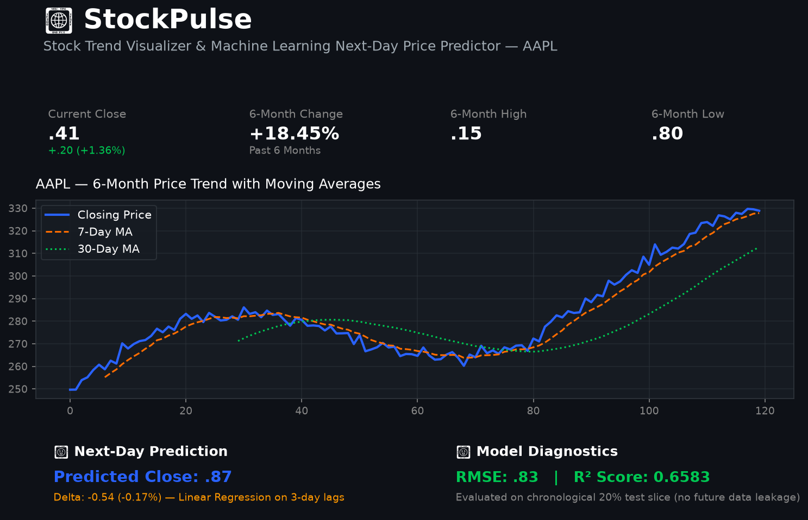

# 📈 StockPulse

> **Stock Trend Visualizer & Multi-Model Machine Learning Next-Day Price Predictor**

StockPulse is an interactive financial analytics and machine learning dashboard built with **Streamlit**, **Python**, **Plotly**, and **scikit-learn**. It enables users to analyze historical stock data for US and Indian equities, visualize price action via Line and Candlestick (OHLC) charts, compare cumulative asset growth, and benchmark **Linear Regression** vs. **Random Forest Regressor** models for next-day price forecasting.

---

## 📸 Demo Preview



---

## ✨ Features

* **Global & Indian Market Support:** Query any public equity symbol from Yahoo Finance (e.g., `AAPL`, `MSFT`, `GOOGL`, `TSLA`, `TCS.NS`, `RELIANCE.NS`, `INFY.NS`).
* **Flexible Visualizations:** Toggle between standard **Line Charts** with 7-day and 30-day Moving Averages and high-resolution **OHLC Candlestick Charts**.
* **Multi-Model ML Benchmarking:** Direct side-by-side comparison between:
  - **Linear Regression:** Fast parametric baseline model.
  - **Random Forest Regressor:** Non-linear ensemble model of 100 decision trees.
* **Chronological Model Diagnostics:** Rigorous evaluation reporting **Root Mean Squared Error (RMSE)** and **$R^2$ Score** on an un-shuffled chronological test split (preventing lookahead data leakage).
* **Multi-Stock Comparator:** Compare cumulative 6-month percentage growth and annualized volatility across multiple assets simultaneously.
* **Key Financial Metrics:** Instant calculation of Current Close, 6-Month Period % Change, 6-Month High, and 6-Month Low.
* **Defensive Engineering & Caching:** Streamlit caching (`@st.cache_data`) for network optimization, with graceful handling of invalid tickers.
* **Educational Disclaimer:** Prominent banner emphasizing experimental educational use—not financial advice.

---

## 🛠️ Tech Stack

| Technology | Purpose |
| :--- | :--- |
| **Python 3.10+** | Core programming language |
| **Streamlit** | Reactive web application framework |
| **yfinance** | Financial market data ingestion |
| **pandas** | Time-series data manipulation, rolling windows, and lag feature creation |
| **Plotly** | High-performance interactive visualizations (Line, Candlestick, Multi-line) |
| **scikit-learn** | Supervised learning (Linear Regression, Random Forest) and evaluation |

---

## 🔄 How It Works

Data flows linearly from user input to interactive prediction:

```text
User Enters Ticker (e.g., "AAPL", "TCS.NS")
               │
               ▼
      Yahoo Finance API
               │
               ▼
   Historical Daily OHLCV Data (~6 Months)
               │
               ▼
      Feature Engineering
   ├── 7-day & 30-day Moving Averages (MA7, MA30)
   └── Lag Features (t-1, t-2, t-3 Closing Prices)
               │
               ▼
   Multi-Model Training & Chronological Split (80/20)
   ├── Linear Regression (Baseline)
   └── Random Forest Regressor (100 Trees Ensemble)
               │
               ▼
   Model Evaluation (RMSE, R²) & Next-Day Forecasts
               │
               ▼
     Interactive Streamlit Dashboard
```

---

## 📁 Project Structure

```text
StockPulse/
├── app.py              # Frontend: Streamlit dashboard, Plotly charts, multi-model tabs
├── model.py            # Backend: Data fetching, feature engineering, Linear Regression & Random Forest
├── requirements.txt    # Application dependencies
├── README.md           # Project documentation and interview guide
├── .gitignore          # Excludes virtual envs, caches, and IDE files
├── assets/
│   └── screenshot.png  # Application screenshot preview
└── tests/
    └── test_model.py   # Unit test suite verifying feature lags, multi-model predictions, and metrics
```

---

## 🤖 Machine Learning Approach

### 1. Autoregressive Lag Features
Financial time series cannot be fed into standard regression algorithms without transforming temporal sequences into supervised tabular pairs. For each trading day $t$:
* $\text{Close\_Lag1} = \text{Close}_{t-1}$ (Yesterday's close)
* $\text{Close\_Lag2} = \text{Close}_{t-2}$ (2 days ago)
* $\text{Close\_Lag3} = \text{Close}_{t-3}$ (3 days ago)
* $\text{Target} = \text{Close}_{t}$ (Today's close)

To predict unobserved trading day $T+1$ (tomorrow), the models ingest $[ \text{Close}_{T}, \text{Close}_{T-1}, \text{Close}_{T-2} ]$.

### 2. Linear Regression vs. Random Forest
* **Linear Regression:** Assumes a linear relationship across consecutive price lags. Fast and interpretable, but sensitive to extreme outliers.
* **Random Forest Regressor:** An ensemble of 100 decorrelated decision trees that uses bagging (bootstrap aggregation) to capture potential non-linear regimes and cap extreme predictions.

### 3. Chronological Train/Test Split
Standard cross-validation randomly shuffles observations. Doing this in financial forecasting causes **lookahead bias (data leakage)**. StockPulse enforces a **strict chronological split**:
* First 80% of historical days $\rightarrow$ Training set
* Most recent 20% of historical days $\rightarrow$ Out-of-sample Test set

---

## ⚠️ Limitations

* **Non-Stationarity & Random Walk:** Stock prices frequently exhibit random-walk characteristics. A high $R^2$ on short-term price lags often simply reflects price inertia rather than predictive momentum.
* **No Macro or Sentiment Data:** The models currently rely exclusively on price lags and ignore interest rates, inflation, earnings announcements, and breaking news sentiment.
* **Single-Step Forecasting:** The models predict one trading day ahead; multi-step compounding forecasts require iterative simulation and accumulate error rapidly.

---

## 💻 Installation & Local Setup

### 1. Clone the Repository
```bash
git clone https://github.com/TanmayAgg890/StockPulse.git
cd StockPulse
```

### 2. Create and Activate Virtual Environment
**On Windows:**
```powershell
python -m venv venv
venv\Scripts\activate
```

**On macOS / Linux:**
```bash
python3 -m venv venv
source venv/bin/activate
```

### 3. Install Dependencies
```bash
pip install -r requirements.txt
```

### 4. Run Automated Tests
```bash
python -m unittest tests/test_model.py
```

### 5. Launch the Streamlit App
```bash
streamlit run app.py
```
Open your browser at `http://localhost:8501`.

---

## ⚖️ Disclaimer

**This software is an educational and academic demonstration only.** It is not financial advice, trading advice, or a recommendation to buy or sell securities.
